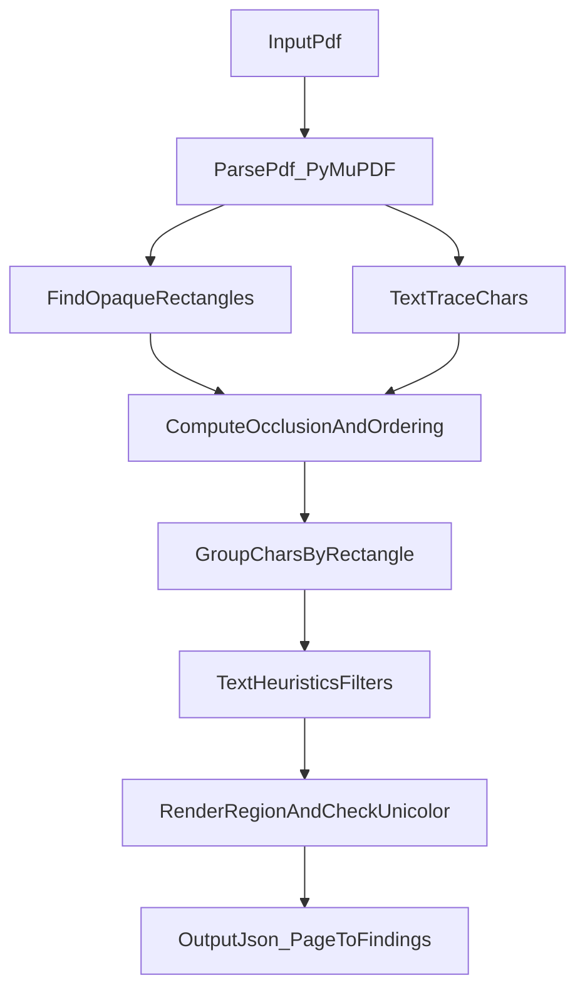

# Detection Model

This document explains how `x-ray` detects likely PDF redaction failures and
where the model may miss cases.

## Pipeline Overview

## Step-by-Step Behavior

Core implementation lives in `xray/pdf_utils.py` and `xray/text_utils.py`.

1. **Candidate rectangle selection**
   - Enumerates page drawings
   - Keeps filled, fully opaque rectangles over minimum size thresholds
   - Skips likely header artifacts and non-filled boxes

2. **Text occlusion analysis**
   - Uses text trace spans and character boxes
   - Checks overlap with candidate rectangles
   - Uses draw order and color comparisons to distinguish hidden vs visible text

3. **Character grouping**
   - Associates intersecting characters with rectangles
   - Handles stacked rectangle scenarios by sequence ordering

4. **Text heuristics filtering**
   - Removes repeated filler-like values (for example, `XXXX`)
   - Removes empty/whitespace-only captures
   - Removes known acceptable marker words (for example, forms of `redacted`)
   - Suppresses date-only findings at document level

5. **Pixmap confirmation**
   - Renders candidate rectangle region
   - Keeps only unicolor regions as likely overlaid redaction blocks

## Output Semantics

For each page with findings, output includes:

- `bbox`: coordinates of candidate failed redaction
- `text`: recoverable underlying text

An empty dictionary (`{}`) means no findings under current heuristics.

## Known Limitations

`x-ray` is heuristic and can miss or misclassify edge cases.

Known categories:

- Complex layering where hidden/visible text overlap in difficult patterns
- PDFs using unusual drawing rules/clipping behaviors
- Image/OCR-centered leakage patterns outside vector/text pipeline

Reference example from tests:

- `tests/test_utils.py` includes an expected-failure case for
  `hidden_text_on_visible_text.pdf`, documenting a currently difficult pattern.

## Tuning and Validation Strategy

For internal improvements:

- Add representative PDFs to `tests/assets/`
- Add regression tests before changing heuristics
- Validate both false-positive and false-negative impact
- Favor deterministic behavior over ad hoc exceptions
